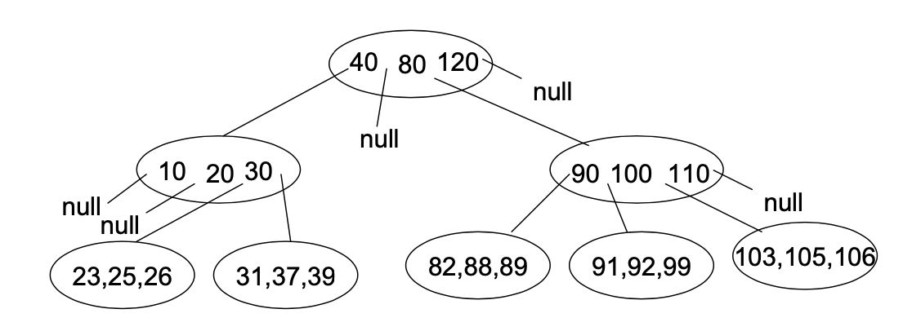

# CS 112 Spring 2020 – Midterm I

## Instructions

> Write the answer to each question directly under the question. You may use as much space as needed to write your answer, and your answer can span multiple pages. Do not change the order of the questions. Type all your text answers (do not handwrite). If you need to draw something, you may draw it in Word itself. Or, you may draw it on a separate piece of paper (NEATLY!), take a picture, and insert it in this document where it should go in your answer.

## Questions

### Question 1: BST [14 pts]

Implement a method to return the 2nd largest key in a BST that has unique keys, i.e. no duplicates. Your method should visit as few nodes in the tree as possible, otherwise you will get at most half credit.

You may not transform the tree. You may implement helper methods as needed.

```java
import java.util.NoSuchElementException;

public class BSTNode {
   int key;
   BSTNode left;
   BSTNode right;

   public BSTNode(int key, BSTNode left, BSTNode right) {
      this.key = key;
      this.left = left;
      this.right = right;
   }

   /**
    * @param root BST
    * @return Second largest key
    * @throws NoSuchElementException If tree has fewer than 2 keys
    */
   public static int secondLargest(BSTNode root) throws NoSuchElementException {
      // COMPLETE THIS METHOD
   }
}
```

### Question 2: M-ary Tree [14 pts]

An m-ary tree is a tree in which every node has at most `m` children

1. 1b [3 pts]

   For this part of the question, consider a special m-ary tree in which a node either has exactly `m` children or no children. What is the minimum number of nodes in a special m-ary tree of height `h`? (A single node tree has height `0`). Your answer should be a general formula in `m` and `h`. Show how your formula applies on a special tree with `h = 3` and `m = 3` by drawing the tree structure. You may use a simple text drawing for the tree, like the ones in problem set 6, and you can put any random values at the nodes. (We’re looking for the tree shape, not for values.)

2. 2b [6 pts]

   Suppose each node of an m-ary tree stores (`m-1`) keys, `k1`, `k2...km - 1` in ascending order. All keys `k` such that `k < k1` are stored in the first subtree of this node, all keys `k` such that `k1 < k < k2` are stored in the second subtree, and so on. And all keys `k` such that `k > km - 1` are stored in the `m`-th subtree.

   Here's an example 4-ary tree, with 3 keys in each node (although not shown, assume that all subtree pointers in the leaf nodes are null):

   

   A search for a target key, `kt`, proceeds as follows (recursive):

   > If root is `null`, return false. Otherwise, do a sequential search of `kt` against the keys `ki`, `1 <= i <= m − 1`, at the root. If a match is found, return true. Otherwise, if `kt < ki` for some `i`, then recursively search the `i`-th subtree and return the result. Otherwise, it must be that `kt > km − 1`, in which case recursively search the `m`-th subtree, and return the result.

   For an m-ary tree of height `h` (`h = 0` for single node tree), how many key-to-key comparisons (exact number, not big O) would it take in the worst case to successfully search for a target key? Give your answer in terms of `m` and `h`. List all the steps of your derivation toward the answer.

3. 2c [5 pts]

   For this part, assume a full m-ary tree, in which every level has the maximum possible number of nodes. If `n` is the total number of nodes in a full m-ary tree, what is the formula for its height, `h`, in terms of `n`? (`h = 0` for a single node tree.) First, write down the number of nodes `n` for a few (at least 4) `h` values. Then use the pattern you see in the relationship between `n` and `h` to work out a general formula for `h` in terms of `n`. Your answer should be simplified down to one term. Show each step in your derivation of this formula.

### Question 3: AVL Tree [17 pts]

Implement a method to build an AVL tree out of a sorted (ascending order) array of unique integers, with the fastest possible big O running time. You may implement private helper methods as necessary. If your code builds a tree that is other than an AVL tree, you will not get any credit. If your code builds an AVL tree, but is not the fastest big O implementation, you will get at most 12 points. You may use any of the [`Math`](https://docs.oracle.com/en/java/javase/14/docs/api/java.base/java/lang/Math.html) class methods (`max`, `min`, `abs`, etc.) as needed.

Hint: Given that the input array is sorted, think of how you might build the tree without doing any rotations.

```java
public class AVLTreeNode {
   public int key;
   public AVLTreeNode left;
   public AVLTreeNode right;
   public int height;
   public char balanceFactor; // '/', '\', or '-'

   public AVLTreeNode(int key, AVLTreeNode left, AVLTreeNode right, char balanceFactor) {
      this.key = key;
      this.left = left;
      this.right = right;
      height = 0;
      this.balanceFactor = '-';
   }

   /**
    * Builds an AVL tree
    * @param array Sorted array of integer keys
    * @return The root of the tree, null if array is empty
    */
   public static AVLTreeNode buildAVLTree(int[] array) {
      // COMPLETE THIS METHOD
   }
}
```
